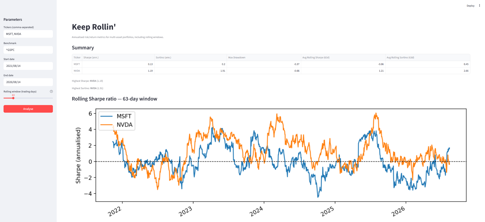

# Keep Rollin'

[](https://github.com/thorstentepper/keep-rollin/actions/workflows/ci.yml)
[](https://codecov.io/gh/thorstentepper/keep-rollin)
[](https://github.com/astral-sh/ruff)
[](https://mypy-lang.org/)
[](https://www.python.org/downloads/)
[](https://opensource.org/licenses/MIT)
[](https://keep-rollin.streamlit.app/)

[](https://keep-rollin.streamlit.app/)


## Description

Computes annualised risk/return metrics for multi-asset portfolios, including rolling windows:

- **Sharpe ratio** — excess return per unit of total volatility
- **Sortino ratio** — excess return per unit of downside volatility (doesn't penalise upside)
- **Max drawdown** — largest peak-to-trough decline over the period
- **Rolling Sharpe ratio** — Sharpe ratio computed over a sliding window (default: 63 trading days ≈ 1 quarter)
- **Rolling Sortino ratio** — same, but penalising only downside volatility within each window

Two conventions apply everywhere — to the CLI, the dashboard and the API alike:

- **Excess return is measured against the benchmark, not a risk-free rate** — closer to an information ratio than a textbook Sharpe ratio, and a deliberate choice ([0004](docs/decisions/0004-measure-excess-return-against-a-benchmark.md)). The benchmark is any Yahoo Finance symbol: an index, a sector ETF, or a single stock.
- **Date ranges are inclusive at both ends** ([0013](docs/decisions/0013-treat-date-ranges-as-inclusive-at-both-ends.md)), and returns are annualised with a 252-trading-day year.

Data is fetched live from Yahoo Finance. If Yahoo Finance is unavailable, the dashboard falls back to a small price snapshot shipped with the package so it still renders — clearly flagged as offline data.


## Installation

```bash
uv sync --all-extras          # library + CLI + dev tools + Streamlit + API
```

Streamlit is a default dependency group, so it installs even without extras
([0015](docs/decisions/0015-install-streamlit-as-a-default-dependency-group.md)). For a
genuinely minimal install:

```bash
uv sync --no-default-groups   # library + CLI only
```


## Usage

### Streamlit app

```bash
uv run streamlit run streamlit_app.py
```

Opens an interactive dashboard in your browser: pick tickers, benchmark, date range, and rolling window from the sidebar and click **Analyse**.

It opens on MSFT and NVDA against the S&P 500, over the five years ending on the previous trading day ([0010](docs/decisions/0010-default-to-five-years-ending-on-the-previous-trading-day.md)).

### Docker

The Dockerfile has two runtime targets. The dashboard is the default:

```bash
docker build -t keep-rollin .
docker run --rm -p 8501:8501 keep-rollin
```

Then visit <http://localhost:8501>.

The API is a separate target:

```bash
docker build --target api -t keep-rollin:api .
docker run --rm -p 8000:8000 keep-rollin:api
```

Then visit <http://localhost:8000/docs>.

| Target | Serves | Port | Healthcheck |
|--------|--------|------|-------------|
| `dashboard` (default) | Streamlit dashboard | 8501 | `/_stcore/health` |
| `api` | FastAPI JSON API | 8000 | `/health` |


**The `rollin` CLI ships in both images**, since it installs with the package. Override the command to use it without starting a server:

```bash
docker run --rm keep-rollin rollin MSFT NVDA
```

Both images run as a non-root user.

The build requires BuildKit, so Docker needs `buildx` available ([0009](docs/decisions/0009-build-separate-docker-targets-per-service.md)).

### CLI

```bash
rollin MSFT NVDA
```

Every argument is optional and defaults to the same values as the dashboard and the API, so a bare `rollin` analyses the default tickers over the default window.

| Argument | Default | Description |
|----------|---------|-------------|
| `tickers` | `MSFT`, `NVDA` | Yahoo Finance symbols, space-separated |
| `--benchmark` | `^GSPC` | Benchmark symbol: any index, ETF or individual stock |
| `--start` | 5 years before `--end` | Start date `YYYY-MM-DD` |
| `--end` | previous trading day | End date `YYYY-MM-DD`, inclusive |
| `--rolling-window` | `63` | Rolling window in trading days, 2–252 (for both Sharpe and Sortino) |
| `--plot` | off | Display rolling Sharpe and Sortino ratio charts |

Override any of them:

```bash
rollin AAPL --benchmark ^GSPC --start 2023-01-01 --end 2023-12-31 --rolling-window 21
```

Because the benchmark is just another symbol, pointing it at a competitor turns the same command into relative-value analysis:

```bash
rollin MSFT NVDA --benchmark AAPL --start 2023-01-01 --end 2023-12-31
```

Over 2023 that drops MSFT's Sharpe from 1.33 against the S&P 500 to 0.16 against AAPL: it beat the index comfortably and its competitor barely.

### HTTP API

```bash
uv sync --extra api
uv run uvicorn keep_rollin.api:app --reload
```

Interactive docs at <http://localhost:8000/docs>.

```bash
curl "http://localhost:8000/metrics?tickers=MSFT&tickers=NVDA&start=2023-01-01&end=2023-12-31"
```


| Endpoint | Description |
|----------|-------------|
| `GET /metrics` | Same metrics as the CLI, as JSON — one object per asset |
| `GET /health` | Liveness probe; also reports whether the offline snapshot is present |

Query parameters for `/metrics`:

| Parameter | Default | Description |
|-----------|---------|-------------|
| `tickers` | `MSFT`, `NVDA` | Yahoo Finance symbol; repeat the parameter for several |
| `start` | 5 years before `end` | Start date `YYYY-MM-DD` |
| `end` | previous trading day | End date `YYYY-MM-DD`, inclusive |
| `benchmark` | `^GSPC` | Benchmark symbol: any index, ETF or individual stock |
| `rolling_window` | `63` | Rolling window in trading days (2–252) |

Every parameter is optional and each defaults independently, so `curl http://localhost:8000/metrics` is a valid request that returns the same defaults the dashboard opens on.

The response includes `used_fallback`, which is `true` when live data was unavailable and the offline snapshot was served instead. Metrics that are mathematically undefined for the data (an infinite Sortino ratio, for instance) are returned as `null`.


### Refreshing the offline snapshot

The bundled snapshot backs the dashboard when Yahoo Finance is unavailable. Regenerate it with:

```bash
uv run python scripts/refresh_fallback.py
```

Pass tickers and `--benchmark` / `--start` / `--end` to change what it covers.


## Running tests

```bash
uv run pytest
# with coverage
uv run pytest --cov
```

CI also lints and type-checks. To reproduce it locally, run what the workflow runs:

```bash
uv run ruff check src tests scripts streamlit_app.py
uv run ruff format --check src tests scripts streamlit_app.py
uv run mypy src
```


## Project structure

The package lives under `src/keep_rollin/`, with metrics, data access, CLI and
API as separate modules ([0002](docs/decisions/0002-restructure-the-notebook-as-an-installable-package.md)).
GitHub's file listing covers the layout; four things in it are not obvious:

- **`src/keep_rollin/resources/fallback_prices.parquet`** — an offline price snapshot shipped inside the package, served (and flagged) when Yahoo Finance is unavailable ([0007](docs/decisions/0007-ship-an-offline-price-snapshot-as-a-fallback.md)).
- **`streamlit_app.py` at the repository root** — where Streamlit Community Cloud expects to find it ([0011](docs/decisions/0011-deploy-the-dashboard-to-streamlit-community-cloud.md)).
- **Streamlit is a dependency group, not an extra** — the deployment host runs a bare `uv sync`, which installs groups but skips extras ([0015](docs/decisions/0015-install-streamlit-as-a-default-dependency-group.md)).
- **`tests/conftest.py`** — pins matplotlib's headless backend, because Streamlit renders on a worker thread where an interactive backend crashes the interpreter.


## Credits

The project was inspired by a DataCamp exercise on the Sharpe Ratio (original tasks by Stefan Jansen, completed in January 2022). However, everything in this repository was written from scratch.
